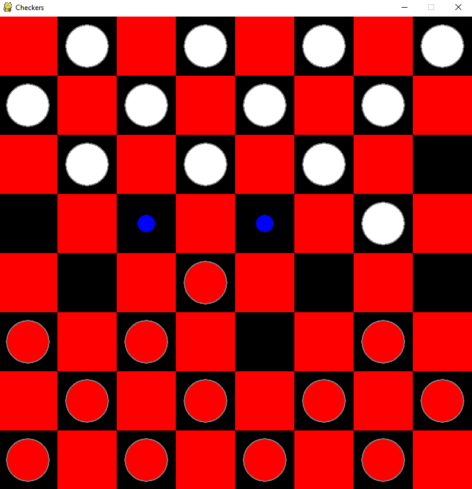

# Checkers-AI

This repo contains :
- A basic 2 player checkers game
- A 1 player checker game against an AI
  -  The AI uses a minimax algorithm to determine the best move

Clicking on a piece will bring the possible moves for that piece shown by the blue circles, click onto the circle to move there
